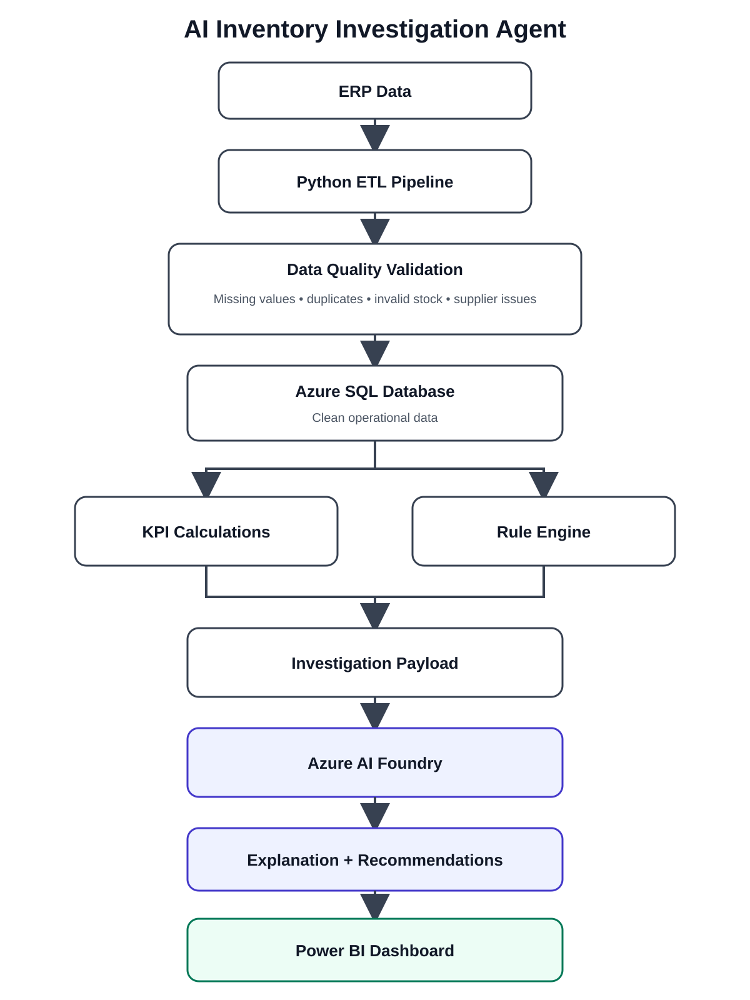

# AI Inventory Investigation Agent

An AI-assisted inventory investigation system that combines data engineering, business rules, analytics, and generative AI to investigate stock anomalies and support operational decision-making.

## Overview

Inventory discrepancies often require staff to manually check stock records, supplier activity, inventory movements, and operational KPIs before identifying a likely cause.

This project automates that investigation workflow by combining Python, Azure SQL, deterministic business rules, Azure AI Foundry, and Power BI.

## Architecture



## Data Pipeline

The Python ETL pipeline extracts CSV-based operational data and performs initial transformation and validation.

Current checks include:

- duplicate removal
- empty-row removal
- missing-value validation
- inventory-data validation
- supplier-data validation

Clean operational data is prepared for storage and analysis in Azure SQL.

## Azure SQL Data Model

The database contains tables covering:

- products and categories
- stores
- suppliers
- product-supplier relationships
- purchase orders
- goods receipts
- current inventory
- store-level reorder settings
- inventory movements

Inventory movements include events such as:

- purchases
- sales
- transfers
- waste
- theft
- adjustments

## KPI and Rule Layer

Deterministic calculations and business rules are used before the AI layer.

Example indicators include:

- stock below reorder point
- negative or abnormal inventory variance
- supplier delivery delays
- high sales activity with low stock
- waste or adjustment activity
- outstanding purchase orders

This keeps numerical calculations and known business logic outside the language model.

## Investigation Payload

Relevant KPI results and triggered rules are combined into a structured payload.

Example:

```json
{
  "sku": "SKU-1045",
  "store": "MEL01",
  "quantity_on_hand": 12,
  "reorder_point": 30,
  "recent_sales_units": 48,
  "open_po_quantity": 50,
  "supplier_delay_days": 7,
  "days_overdue": 3,
  "triggered_rules": [
    "BELOW_REORDER_POINT",
    "SUPPLIER_DELIVERY_OVERDUE"
  ]
}
```

```markdown

## Azure AI Foundry

The structured investigation payload is sent to Azure AI Foundry for interpretation.

The AI layer produces:

- likely cause

- operational severity

- explanation of contributing factors

- recommended follow-up actions

The model is instructed to use only the supplied evidence and identify when additional information is required.

The AI integration is located in:

`ai/investigation_agent.py`

## Human-in-the-Loop

The system is designed to support operational decision-making rather than automatically execute inventory actions.

AI-generated explanations and recommendations are reviewed by a user before action is taken.

This keeps final responsibility with the decision-maker while using AI to reduce investigation effort.

## Power BI

Investigation results are surfaced in Power BI alongside operational metrics such as:

- inventory anomalies

- affected products

- issue severity

- triggered rules

- supplier performance

- recommended actions

- recurring inventory issues

This allows users to review both the underlying evidence and the AI-generated explanation in one place.

## Example Investigation

**Issue**

SKU-1045 has fallen below its reorder point.

**Evidence**

- Quantity on hand: 12

- Reorder point: 30

- Recent sales activity: High

- Outstanding purchase order: 50 units

- Supplier delivery: 3 days overdue

- Triggered rules:

  - BELOW_REORDER_POINT

  - SUPPLIER_DELIVERY_OVERDUE

**AI Explanation**

The low inventory level is likely being driven by continued sales activity combined with a delayed supplier delivery. The current stock level is below the defined reorder threshold, increasing the risk of a stock-out.

**Recommended Action**

Review the outstanding supplier delivery, confirm the revised delivery date, and consider an urgent replenishment or alternate supplier if the delay continues.

## Project Outcome

The project demonstrates how generative AI can be embedded into an operational analytics workflow rather than used as a standalone chatbot.
